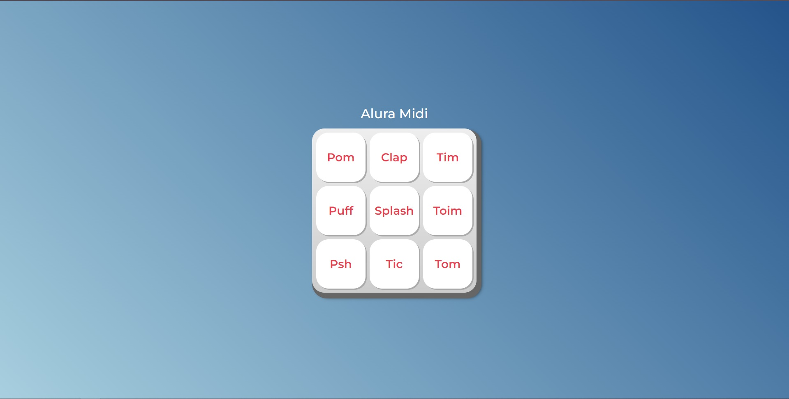

<h1 align="center"> Alura Midi </h1>

Um conjunto de teclas instrumentais para você tocar o seu som!

 

  

## ✔ Tecnologias

Esse projeto foi desenvolvido com as seguintes tecnologias:

- HTML e CSS
- JavaScript
- Git e Github

## 💻 Projeto

Um conjunto de teclas instrumentais para você explorar e tocar seu som da maneira que preferir!

- [Visite o projeto online] (https://patrickpicon.github.io/alura_midi/)
